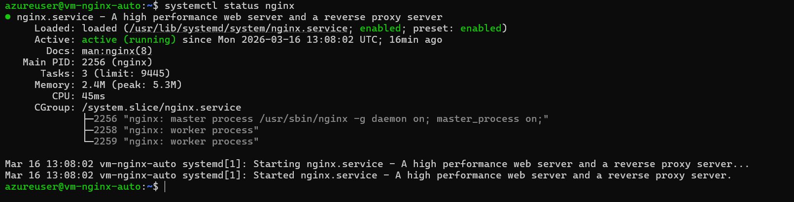
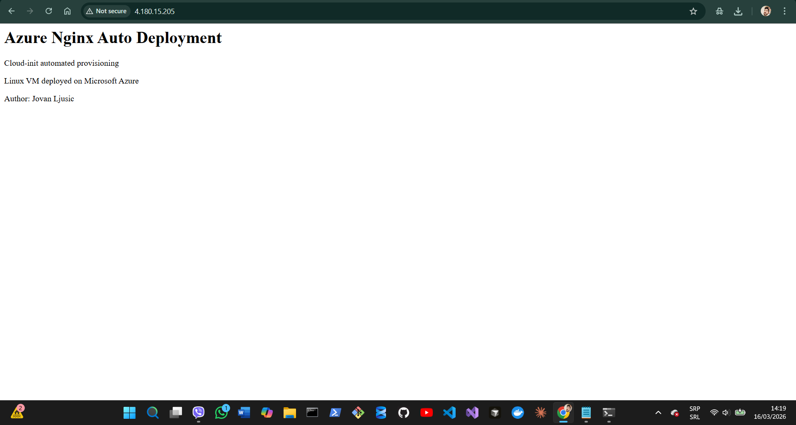
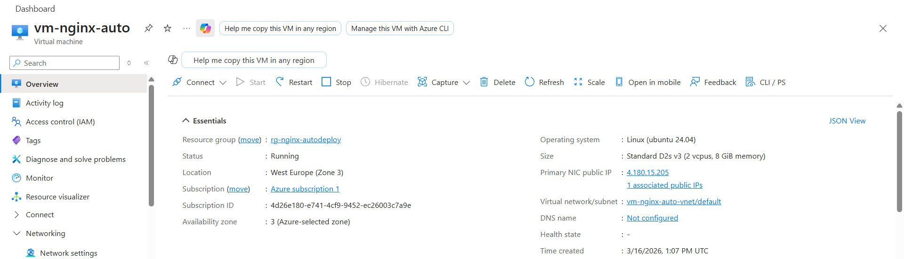
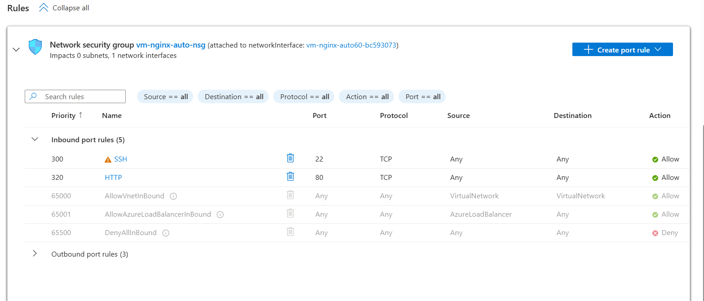

# Azure Nginx Auto Deploy

This project demonstrates automated deployment of an Nginx web server on a Linux VM in Microsoft Azure using cloud-init.

## Architecture

Azure Virtual Machine automatically installs Nginx during provisioning.

Components used:

- Azure Virtual Machine (Ubuntu Linux)
- Azure Virtual Network
- Network Security Group
- Public IP
- cloud-init automation
- Nginx Web Server

## Deployment

cloud-init configuration:

#cloud-config
package_update: true
packages:
 - nginx

runcmd:
 - systemctl start nginx
 - systemctl enable nginx

## Screenshots

### Nginx running

### Web page

### Azure VM

### Networking

## Author

Jovan Ljusic